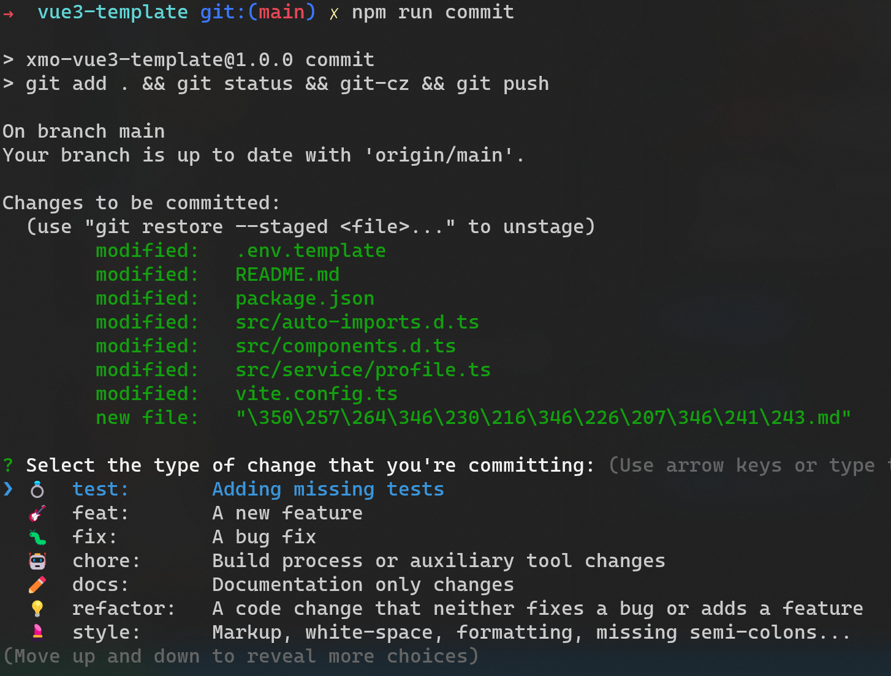

# Xmo-vue3-template 一个旨在用最小成本最大化压榨`Vue3+Vite2`开发效率的后台开发模板

> [github 地址](https://github.com/darkXmo/vue3-template)

> [项目预览地址](https://darkxmo.github.io/vue3-template)

## 前言

### 为什么 WHY

使用 `xmo-vue3-template` ，你将可以

0. 拥有如同新年穿上新内裤一样舒适的开发体验

1. 获得一套开箱即用的后台管理系统
2. 使用最佳的模块化的代码规范进行代码审核
3. 节省您的时间和精力
4. 最大化体验 `vite2+vue3+typescript` 的开发魅力

5. 同时，由于作者本人会持续根据技术迭代更新本模板，关注本模板，将能在后续同步体验到经过作者验证的最佳开发效率化方案。

### 怎么做 HOW

`xmo-vue3-template` 拥有以下几个属性。其中可能有你没有听说过的内容，而如果你希望尝试最佳的开发体验，我推荐你去了解它们，你会获得与以往`Vue`项目绝然不同的开发体验。

1. 使用 `prettier` `commitlint` `git-cz` 和 `husky` 进行质量管理；
2. 项目结构才用模块化(`modules`)设计而非传统的组件化设计(`components`)；
3. 利用丰富的 `vite` 插件，减少`api`和组件 `import`导入；
4. 利用 `typescript` 进行代码类型保障，尤其注意前后端类型的统一；

## 质量管理

1. [`prettier`](https://prettier.io/)可以为你提供代码格式的一致化，例如

   1. 代码应该有多少缩进；

   2. 什么时候要换行；

   3. More...

      你可以有自己的代码风格，但是它有可能会导致混乱，相比之下，`prettier`原版代码风格则能为你和你的团队提供稳定的开发体验，而不必为代码格式不一致而发愁，减少看不懂别人或自己以前的代码的情况。

      > Q: 为什么不使用`eslint`;
      > A: `eslint`使用门槛相对比较高，另外`eslint`的规范并不统一，还对开发具有侵入性。`eslint`本质上应当搭配`javascript`使用，而在善用`typescript`的前提下，很少有`eslint`的使用空间；

2. [`commitlint`](https://github.com/conventional-changelog/commitlint) + [`git-cz`](https://github.com/streamich/git-cz) 让你的`git commit`提供有效的信息

   大多数时候的大多数开发者的`git commit`都是 shit，基本无法提供有效信息。使用这两个插件提供`commit`规范，以优化这种现象。

   

   不合格的`commit`会被阻止。

   > 强行提交空的`commit`信息: `git commit -m "chore: none"`

3. [`husky`](https://typicode.github.io/husky/#/)

   `husky` 能够劫持 `git` 操作，搭配 `lint-staged` ，可以在 `git commit` 的时候自动帮你格式化代码(默认使用`prettier`)。

## 模块化结构

| 特点     | 组件化                                       | 模块化                                          |
| -------- | -------------------------------------------- | ----------------------------------------------- |
| 组件位置 | 所有`vue`组件都放在`components`文件夹中      | 所有`vue`组件都放在`modules`文件夹中            |
| 页面位置 | `views`或`pages`文件夹                       | `modules` 文件夹                                |
| 相对关系 | 功能相似的组件都放在一起(例如`Form`,`Table`) | 业务相近的组件都放在一起（例如`Login`, `User`） |
| 引用方式 | `import xxx from "@/components/yyy/xxx.vue"` | `import xxx from "./xxx.vue"`                   |
| 关注点   | 关注功能和可复用性                           | 关注业务和页面展示结构                          |

### 组件化的缺点

1. 很多时候，`Vue`开发都很容易陷入为可复用而可复用的情况。
2. 两个个组件明明业务相差甚远，却还是要通过`props`进行可复用性的属性处理，等到出现业务修改，就会导致。
3. 通过组件名称，难以定位这个组件是用来做什么的，无法确认这个组件应该被使用在哪些地方。
4.

## vite 插件

1.

## 善用 typescript
